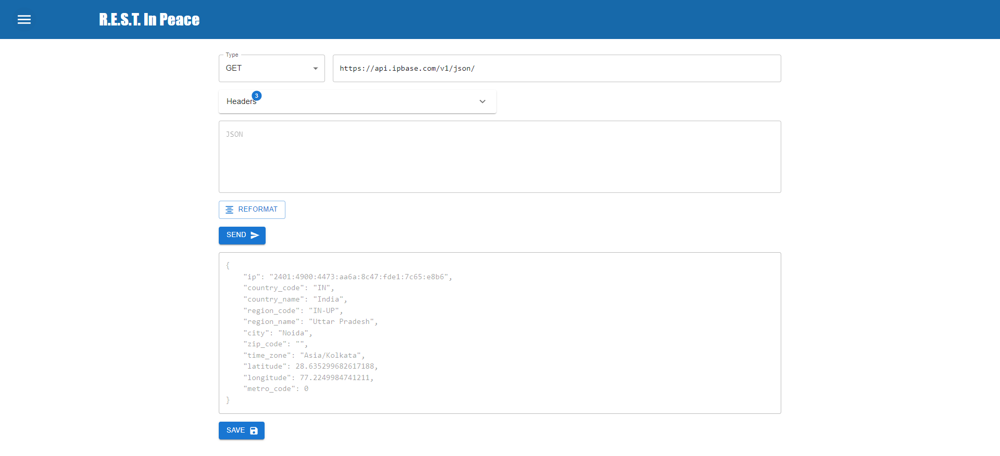

# R.E.S.T. In Peace

REST API Testing Platform



## Installation:

Clone the repository

```bash
npm install
```

## Running the app

### Locally

```bash
npm start
```

### Docker

Create an image

```bash
docker build -t rest .
```

Create and run container

```bash
docker run -d -p 80:80 --name rest-app rest
```

### Kubernetes

Create a cluster on AWS/Azure/GCP or locally using Minikube

Create deployment using kubectl

```bash
kubectl apply -f deployment.yaml
```

Create and expose service

```bash
kubectl apply -f service.yaml
```

Access the app from the Cluster's I.P.
